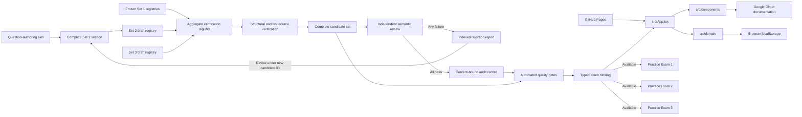
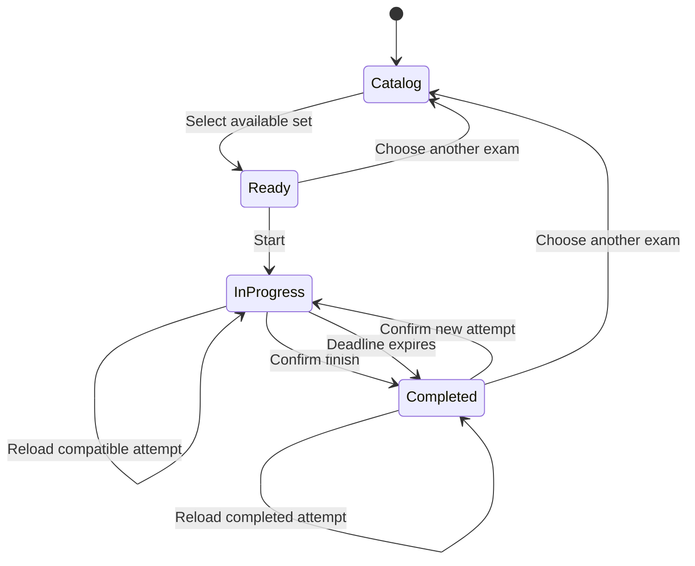

# Practice Exam Architecture

## Target Context

The browser loads a static React application from GitHub Pages. The application imports a typed catalog of immutable TypeScript question sets, stores current or completed attempts in browser `localStorage`, and opens cited Google Cloud documentation in external pages. There is no application server or user account. The catalog offers frozen Practice Exam 1 version 6 and accepted Practice Exams 2 version 4 and 3 version 4.

## Module Ownership

| Module | Ownership |
|---|---|
| `src/domain/` | Owns catalog and question types, attempt state, scoring, structural validation, and persistence contracts. |
| `src/data/questionSets/sections/` | Owns complete, independently mergeable exam-guide sections before full-set assembly. |
| `src/data/questionSets/drafts.ts` | Owns partial question-set manifests used by structural and live-source verification. |
| `src/data/questionSets/candidates.ts` | Owns complete candidate assembly from registered draft identifiers. |
| `src/data/questionSets/practice2/` | Owns Set 2 sections, partial draft, and eventual complete candidate without editing Set 1 composition files. |
| `src/data/questionSets/practice3/` | Owns Set 3 sections, drafts, and versioned candidates without editing prior exam composition files. |
| `src/data/questionSets/registry.ts` | Aggregates per-exam drafts and candidates for structural, source, and audit verification. |
| `src/data/questionSets/index.ts` | Owns the runtime catalog of available and coming-soon exam entries. |
| `docs/reviews/` | Owns independently authored rejection reports and accepted semantic audit records checked by CI. |
| `.opencode/skills/gcp-pde-question-authoring/` | Owns the repository-specific sourcing, drafting, verification, and author-handoff procedure. |
| `.opencode/skills/gcp-pde-question-review/` | Owns final independent semantic review and content-bound audit records. |
| `src/components/` | Owns catalog, start, exam, navigation, submission, and result-review interfaces. |
| `src/App.tsx` | Owns catalog selection, screen transitions, and restoration of the selected set's persisted attempt. |
| `scripts/` | Owns documentation checks, live question-source validation, and review-record generation. |
| `.github/workflows/` | Owns continuous integration, visual cleanup, and GitHub Pages deployment. |

The authoring skill produces one final-count section at a time under a set-specific module tree and registers it in that set's partial draft manifest. `src/data/questionSets/registry.ts` combines the frozen Set 1, Set 2, and Set 3 registries for quality tooling only. `make verify-sources` validates every registered section, fetches every unique evidence URL with at most four concurrent requests, retries transient failures up to three times, and binds indexed audit records to exact registered candidates. A failed review creates an indexed rejection report and returns the affected IDs to an independent author. The rejected candidate remains immutable and registered; corrections use a new candidate ID. CI permits a runtime catalog entry only when its exact acceptance exists and no exact rejection exists, without importing Markdown into the browser bundle. Practice Exam 1 has an additional fixed SHA-256 test that blocks any future drift. `App.tsx` joins catalog selection, domain behavior, and screen components. Domain persistence is the only mutable storage boundary. Result links open Google Cloud source evidence outside the application.

## Set 2 Registry Review Artifact

[Set 2 isolated registry flow](../visual-explanations/set2-registry-flow.svg) is a PR-only review artifact. Before this change, Set 1 section, draft, and candidate modules were the only source-verification path. After this change, `src/data/questionSets/practice2/` owns Set 2 content and corrections, while `src/data/questionSets/registry.ts` combines per-set registries for structural, live-source, and audit checks without editing frozen Set 1 composition files. Reviewers should verify that Set 1 remains isolated and digest-protected, that `src/data/questionSets/index.ts` selects the corrected Set 2 version 2 candidate, and that rejected candidates remain registered for audit history. The SVG is deleted from `main` by `.github/workflows/delete-visual-explanations.yml` after merge.

## Attempt Data Flow

1. The candidate selects an available question set from the catalog.
2. The application restores that set's compatible attempt or creates one with an absolute two-hour deadline when requested.
3. Answer, navigation, and review-flag changes replace the immutable attempt state and persist it locally.
4. Manual submission or deadline expiration creates a completed result.
5. Scoring compares answer identifier sets exactly and calculates total and section percentages.
6. Result review joins each response with choice feedback and source evidence from the immutable question set.

Every in-progress state change is saved under a key derived from the question-set identifier and version. Reload restores only state compatible with the last selected set; malformed or mismatched data is removed. The legacy singleton key migrates once when it contains compatible Practice Exam 1 state. Completed attempts remain read-only until the candidate confirms replacement, and returning to the catalog does not clear them.

## Deployment

Vite builds the static site with `/gcp-de-exam-simulator/` as its base path. After every push to `main`, `.github/workflows/pages.yml` installs the browser test runtime, runs `make test` and `make verify-sources`, uploads `dist/` only if both gates pass, and deploys the artifact to the `github-pages` environment. The workflow has no manual dispatch trigger or required human reviewer.

## Drift Control

`make test` checks documentation structure, TypeScript, ESLint, unit and component behavior, the production build, and desktop and mobile browser flows. Question invariants are checked at section, draft-set, candidate-set, and audit-record boundaries. `make verify-sources` checks draft and candidate registries, every indexed acceptance and rejection record, every available catalog entry, the frozen Practice Exam 1 digest, and all live URLs. Deployment is checked by the automatic Pages workflow and a live URL smoke test.

## Related Decisions

- [Static typed application architecture](/adr/0001-static-typed-application.md)
- [Exam attempt and scoring behavior](/bdr/0001-exam-attempt-and-scoring.md)
- [Typed practice-exam catalog](/adr/0003-typed-practice-exam-catalog.md)
- [Exam catalog and automated publication](/bdr/0004-exam-catalog-and-automated-publication.md)
