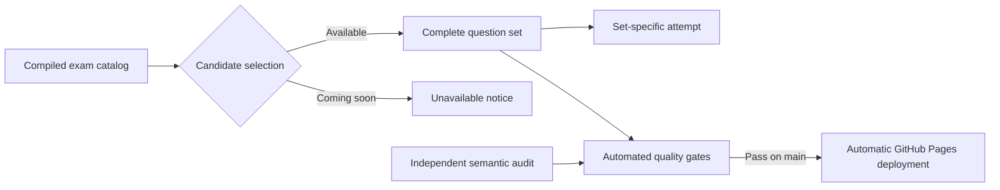

# 0004. Exam Catalog and Automated Publication

## Context

[BDR 0003](/bdr/0003-content-bound-question-activation.md) made a Markdown acceptance record a runtime prerequisite for one active question set. The approved [multi-exam requirements](/prd/0002-multiple-practice-exams.md) replace that singleton activation model with user selection from compiled, validated entries while retaining semantic review as an auditable content-quality process.

## Behavior Flow

## Textual Description

The application starts at a catalog containing typed `available` and `coming-soon` entries. Selecting an available entry opens its ready, attempt, or completed-result state. A coming-soon entry presents status only and cannot construct an attempt. Practice Exam 1 version 6 is the sole available entry; Practice Exam 2 contains metadata only.

Each set/version has an independent browser storage key. Loading Practice Exam 1 checks its new key first, then migrates compatible state from the deployed legacy key and removes that legacy value. Returning to the catalog does not clear saved attempts.

Complete question content still requires structural validation, live Google-owned source verification, and independent semantic audit. CI requires each available catalog entry to have an exact-content acceptance record and no matching rejection record. Audit records remain indexed documentation but are not parsed by runtime application code. A fixed digest test permanently protects Practice Exam 1 version 6. Pushes to `main` run all gates and deploy automatically; users do not manually approve or dispatch publication.

## Scenarios

**Scenario 1: Select an available set**

- Given the catalog contains Practice Exam 1 as available
- When the candidate selects it
- Then the ready screen exposes its 50-question two-hour attempt

**Scenario 2: View an unavailable set**

- Given the catalog contains Practice Exam 2 as coming soon
- When the catalog renders
- Then Practice Exam 2 has no start action and cannot create an attempt

**Scenario 3: Preserve independent attempts**

- Given two available sets have saved attempts
- When the candidate selects either set
- Then only that set and version's compatible attempt restores

**Scenario 4: Migrate legacy Practice Exam 1 state**

- Given the legacy key contains a compatible Practice Exam 1 attempt and the new key is absent
- When Practice Exam 1 loads
- Then the attempt moves to the set-specific key and the legacy key is removed

**Scenario 5: Reject Set 1 drift**

- Given Practice Exam 1 differs from its frozen version-6 digest
- When CI validates the production catalog
- Then the quality gate fails

**Scenario 6: Publish automatically**

- Given a commit reaches `main` and all quality gates pass
- When the Pages workflow completes
- Then the catalog deploys without a manual dispatch or approval step

## Test Design

| Case | Level | Input or scenario | Observable assertion | Proves |
|---|---|---|---|---|
| Available selection | Component | Catalog with one available entry | Selection opens the ready screen | Available sets are usable. |
| Coming-soon entry | Component | Catalog with one unavailable entry | Status renders and no start button exists | Placeholder metadata cannot become an attempt. |
| Set-specific keys | Unit | Attempts for distinct set IDs or versions | Storage keys differ and each attempt restores independently | Sets do not overwrite progress. |
| Legacy migration | Unit | Compatible old-key attempt | New key receives state and old key is removed | Existing users retain Practice Exam 1 progress. |
| Frozen first set | Integration | Production Practice Exam 1 | SHA-256 equals the accepted fixed digest | Set 1 cannot drift. |
| Catalog audit eligibility | Integration | Every available entry and indexed audit records | Exact acceptance exists and no exact rejection exists | Rejected content cannot publish. |
| Full catalog flow | End-to-end | Open, choose Set 1, and start | Question 1 appears on desktop and mobile | Catalog and attempt flow are connected. |
| Unavailable flow | End-to-end | Open production catalog | Set 2 is `Coming soon` without a start action | Incomplete content is not exposed. |
| Automatic deployment | Inspection | Pages workflow | Only `main` push triggers publication | Deployment has no manual path. |
| Removed controls | Component | Result review | `Priority` and `Wrong answers only` are absent | Removed UI does not regress. |

## Related

- Supersedes: [BDR 0003](/bdr/0003-content-bound-question-activation.md)
- PRD: [/prd/0002-multiple-practice-exams.md](/prd/0002-multiple-practice-exams.md)
- ADR: [/adr/0003-typed-practice-exam-catalog.md](/adr/0003-typed-practice-exam-catalog.md)
- Issue: [/issues/0002-add-practice-exam-catalog.md](/issues/0002-add-practice-exam-catalog.md)
