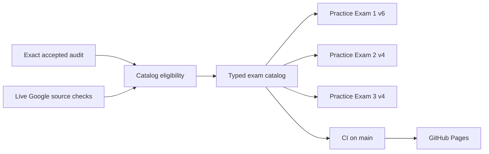

# 0005. Three-Exam Catalog and Reliable Publication

## Context

[BDR 0004](/bdr/0004-exam-catalog-and-automated-publication.md) established the typed catalog and automatic deployment path while Practice Exam 2 was incomplete. Practice Exams 2 version 4 and 3 version 4 are now independently accepted, complete candidates.

## Behavior Flow

## Textual Description

The runtime catalog contains three available 50-question practice exams: Practice Exam 1 version 6, Practice Exam 2 version 4, and Practice Exam 3 version 4. Each available entry requires an indexed acceptance record bound to its exact candidate content and no matching rejection record. Source verification retries transient HTTP failures up to three times, but reports permanent failures. A passing commit to `main` triggers GitHub Pages deployment; the deployment action waits up to 30 minutes for GitHub Pages to finish publishing.

## Scenarios

**Scenario 1: Select a published exam**

- Given the catalog contains any of the three available exams
- When a candidate selects it
- Then the application starts or restores only that exam's independent attempt.

**Scenario 2: Block unaudited content**

- Given a candidate lacks an exact accepted audit or has a matching rejection record
- When the catalog is validated
- Then CI rejects making that candidate available.

**Scenario 3: Tolerate a transient source failure**

- Given a Google-owned evidence URL returns a transient HTTP failure
- When source verification retries it and a later response succeeds
- Then source verification succeeds for that URL.

## Test Design

| Case | Level | Observable assertion | Proves |
|---|---|---|---|
| Published catalog entries | Integration | Practice Exams 2 and 3 are available | Accepted candidates reach the runtime catalog. |
| Audit eligibility | Source verification | Every available entry has an exact acceptance and no matching rejection | Rejected or unaudited content cannot publish. |
| Transient source response | Unit | A retry after HTTP 500 succeeds | Temporary Google documentation failures do not fail publication. |
| Full catalog flow | End-to-end | A candidate selects and starts an available exam on desktop and mobile | The published catalog connects to attempts. |

## Related

- Supersedes: [BDR 0004](/bdr/0004-exam-catalog-and-automated-publication.md)
- PRD: [Complete third practice exam](/prd/0004-complete-third-practice-exam.md)
- Issue: [Author and publish Practice Exam 3](/issues/0004-author-and-publish-practice-exam-three.md)
